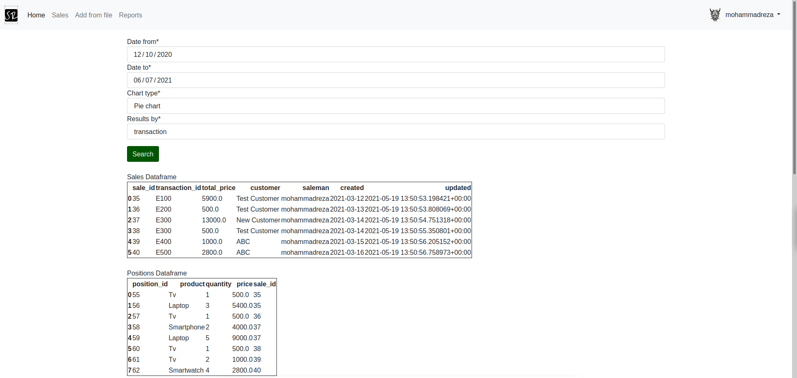
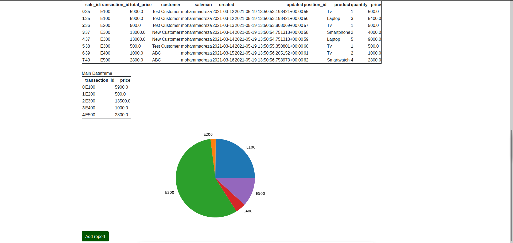
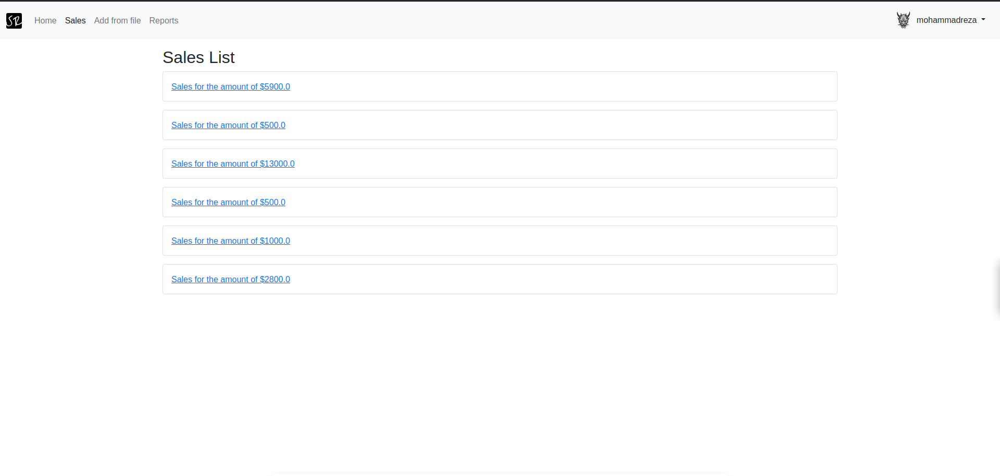
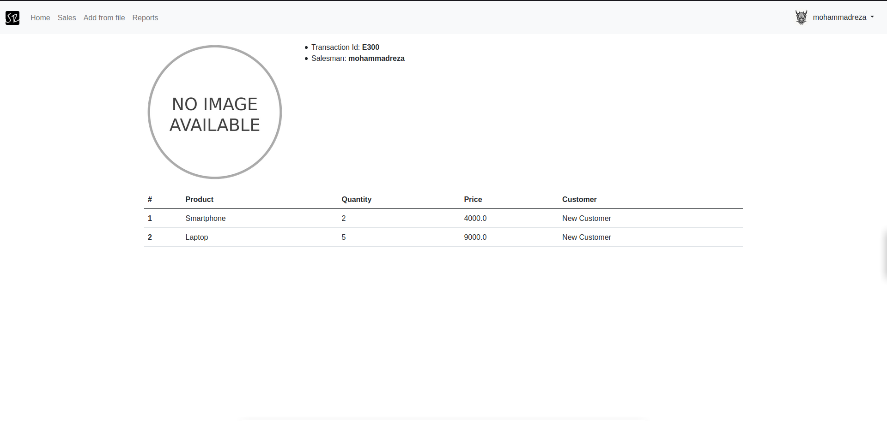
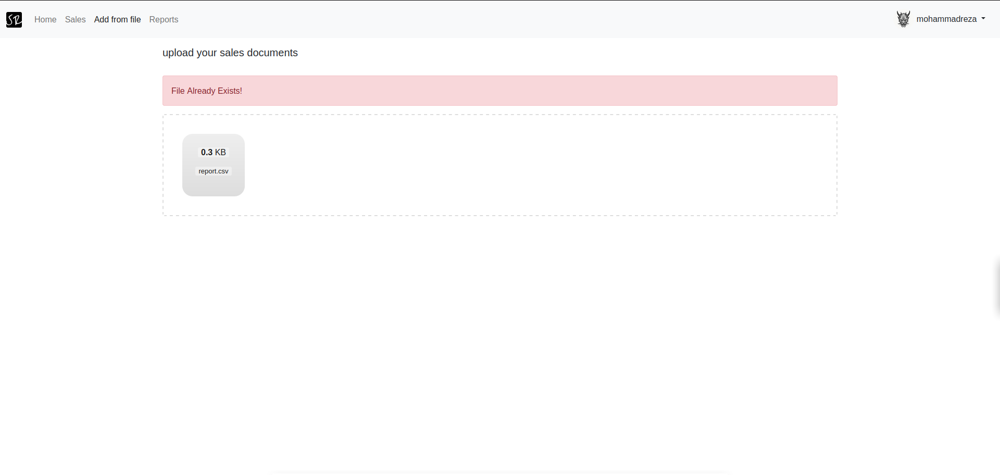
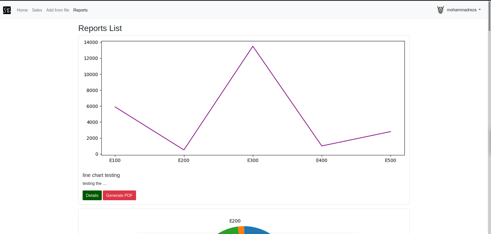
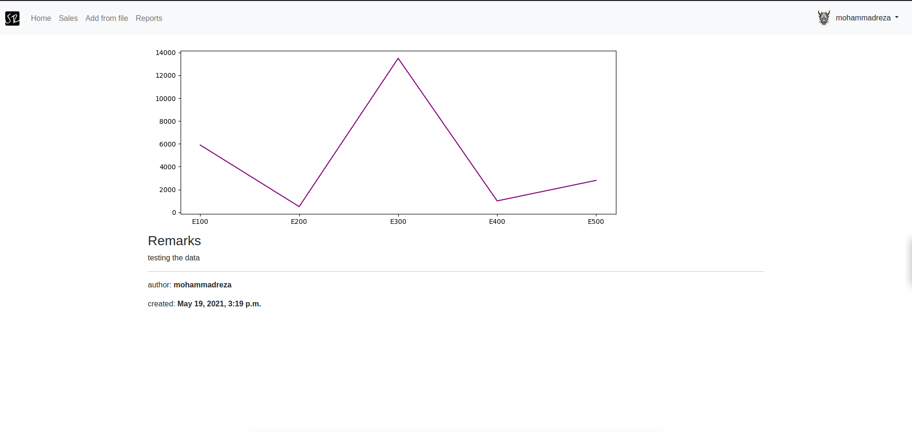
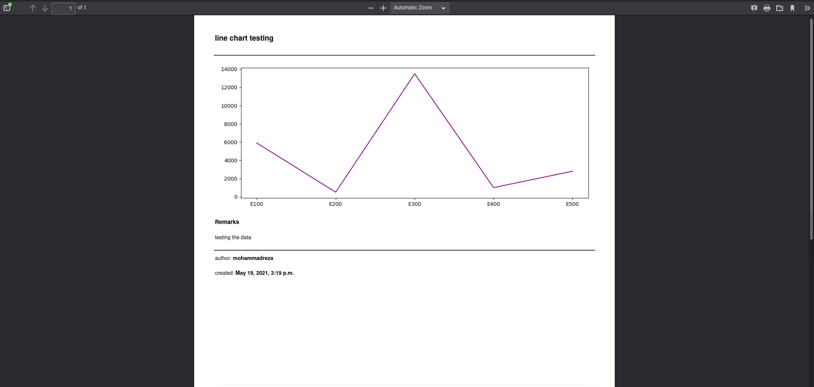
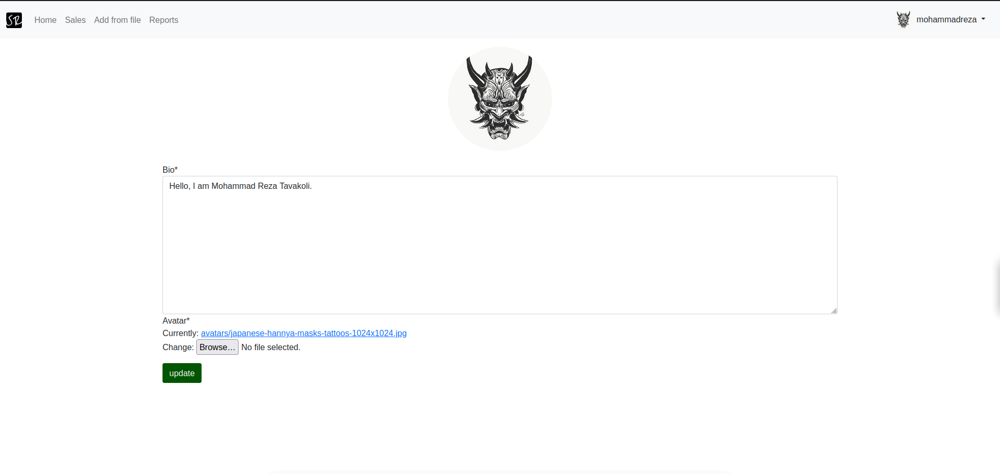

# sale report

## A sale data report generator application with Django 3.1.

---
## *Screenshots of the app*
> All of the web pages are login required

### Home Page
in the home page you can use the search form to find the datas between a certain date and then visulize it with the type of chart you want(Bar chart-Line chart-Pie Chart)
, and the set the "Results By" field to get the results by transaction or their sale's date.

[Home Page View source code](https://github.com/MohammadrezaTavakoli/sale_report/blob/master/src/sales/views.py#L16)

Then You can see the data frames according to your search and the selected chart, Then you can Add a report with the given Data.

You can add a report based on your given chart.

[Create Report View source code](https://github.com/MohammadrezaTavakoli/sale_report/blob/master/src/reports/views.py#L22)

---
### Sales Page
In the sales page you can see all the sale objects list.

[Sales List View source code](https://github.com/MohammadrezaTavakoli/sale_report/blob/master/src/sales/views.py#L80)

Sale objects Detail

[Sales Detail view source code](https://github.com/MohammadrezaTavakoli/sale_report/blob/master/src/sales/views.py#L85)

---
### Add from file
You can drag and drop your csv files to read the data from them and then add them to the database.

*Drag and drop implemented by dropzone.js*

[CSV Upload View source code](https://github.com/MohammadrezaTavakoli/sale_report/blob/master/src/reports/views.py#L52)

---
### Reports
In reports page you can see all of the created reports and you can see every report's detail and you can generate a pdf for the desired report.

[Reports List View source code](https://github.com/MohammadrezaTavakoli/sale_report/blob/master/src/reports/views.py#L38)

reports detail page

[Reports Detail View source code](https://github.com/MohammadrezaTavakoli/sale_report/blob/master/src/reports/views.py#L43)

generating pdf for reports

[Render PDF View source code](https://github.com/MohammadrezaTavakoli/sale_report/blob/f882108693eae74f1e0737c9b7aa79cf36c14e29/src/reports/views.py#L99)

---
### Profile
You can edit and update your profile in this page.

[Profile View source code](https://github.com/MohammadrezaTavakoli/sale_report/blob/master/src/profiles/views.py#L8)

---
## Libraries i used for this Django project:
| Name | Description |
| ----------- | ----------- |
| pandas | Dataframe creation |
| Matplotlib | Chart Implementation |
| PyPDF2 | pdf toolkit(creating pdf,...) |
| xhtml2pdf | HTML to PDF converter |
